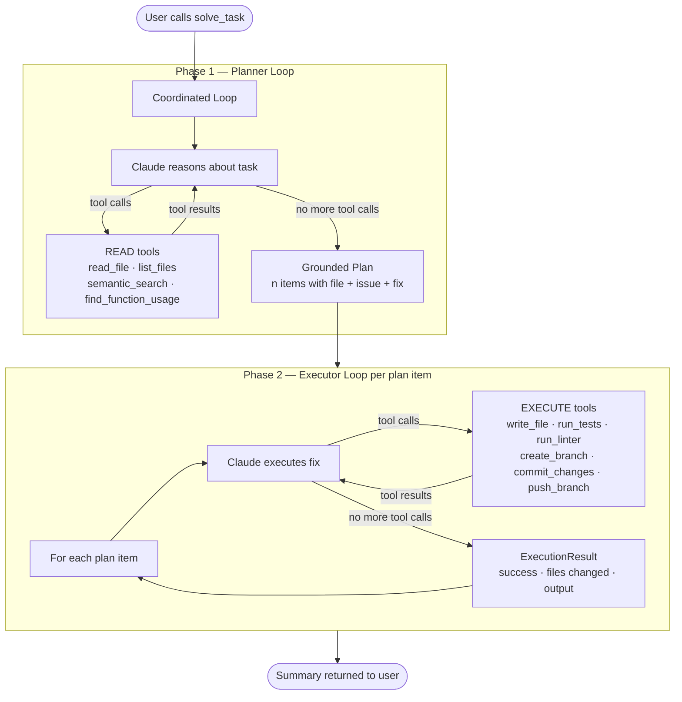

# Autonomous Codebase Engineer (ACE)

An MCP server exposing a ReAct agent loop that lets Claude autonomously explore, modify, test, and ship changes to any codebase.

---

## How it works

`solve_task` is the top-level tool. It runs a two-phase coordinated loop: a **planner** that reads and reasons about the codebase, followed by an **executor** that applies fixes one item at a time. Both phases are independent ReAct loops driven by Claude via Amazon Bedrock.

### Why two loops?

The planner only gets read-only tools — it can't accidentally change anything while exploring. Once it has a concrete, grounded plan (each item tied to a specific file and issue), the executor gets write/test/git tools and works through the items one by one. This separation means the plan is always based on what the code actually looks like, not assumptions.

Both loops share the same underlying `runAgentLoop`: a multi-turn Bedrock conversation where Claude calls tools, gets results back, and keeps going until it has no more tool calls or hits `max_iterations`.

---

## Tools

| Group | Tools |
|---|---|
| Repo | `get_repo` `set_repo` |
| Navigation | `list_files` `read_file` `write_file` `delete_file` `search_files` `grep` `apply_patch` |
| Testing | `run_tests` `run_linter` `run_build` |
| Semantic Search | `index_repository` `semantic_search` |
| Git | `get_current_branch` `create_branch` `commit_changes` `push_branch` `open_pull_request` |
| Intelligence | `summarize_file` `find_function_usage` `analyze_dependencies` |
| Agent | `plan_task` `solve_task` |

---

## Deployment

Runs in two modes:

- **stdio** — default, for local use with Claude Code or Claude Desktop
- **SSE** — set `MCP_TRANSPORT=sse` for remote/Docker deployment behind a reverse proxy

Copy `.env.example` to `.env` and fill in your AWS, database, and GitHub credentials.
